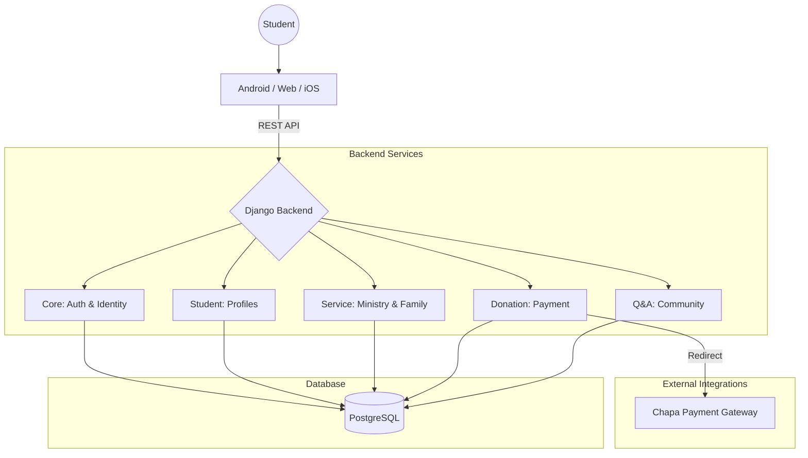

# Finot System Architecture & Frontend Guide

**Version:** 1.0  
**Last Updated:** March 2026  
**Target Audience:** Frontend Developers, UI/UX Designers

---

## 1. System Philosophy & Vision

**"Finot"** is a comprehensive spiritual management control system for university students. Unlike a standard CRUD app, it manages a student's **Spiritual Lifecycle** on campus.

The system is built on **Distributed Responsibility**:
1.  **Identity:** Managed by `Core` (Auth) + `Student` (Profile).
2.  **Community:** Managed by `Service` (Ministries, Families).
3.  **Contribution:** Managed by `Donation` (Financial) and `QuestionAnswer` (Spiritual doubts).

### System High-Level Architecture

---

## 2. The Student User Journey (UX Flow)

This section describes the "Golden Paths" a user takes through the application.

### Phase 1: Onboarding (The Gate)
**Objective:** Establish Identity.

1.  **Sign Up (`/auth/users/`)**: User provides basic credentials.
2.  **Login (`/auth/jwt/create/`)**: System issues a JWT Access Token.
3.  **Critical Check:** Frontend **MUST** immediately fetch `GET /api/student/profiles/me/`.
    *   *Scenario A (200 OK):* User has a profile -> Go to Dashboard.
    *   *Scenario B (404 Not Found):* User is new -> **Redirect to "Complete Profile" Form.**
    *   *Scenario C (401):* Token expired -> Logout.

> **UI Tip:** Do not let a user access the "Service" or "Donation" pages until Profile is complete. The Profile contains the phone number and full name needed for those other apps to work correctly.

### Phase 2: The Service Selection (One-Time Event)
**Objective:** Join a Ministry (Ageglot).

1.  **Browse:** User views `/api/service/groups/` (Read-only list of ministries like Choir, Charity).
2.  **Select:** User submits **Top 3 Preferences** via `/api/service/selections/`.
    *   *Constraint:* Must pick exactly 3 distinct groups.
    *   *Constraint:* Priorities must be 1, 2, and 3.
3.  **Wait:** There is no automatic acceptance. Administrators review selections offline.

> **UI Tip:** Use a "Drag and Drop" interface or numbered dropdowns to let students rank their top 3 choices easily.

### Phase 3: The Daily Routine (Dashboard)
Once a student is established, their Dashboard is their home.

*   **My Family:** Fetch `/api/service/families/my-family/`.
    *   Display the "Father" and "Mother" contact cards vividly.
    *   List "Siblings" as a contact grid.
    *   *Edge Case:* If 404, show "You have not been assigned a family yet."
*   **Events:** Fetch `/api/service/events/`. Show a Calendar or feed view.
*   **Attendance:** Fetch `/api/service/attendance/my-history/` to show a "Participation Score" or simple history log.

---

## 3. Integration Logic & State Management

Frontend state (Redux/Context API) should roughly mirror this structure:

| State Slice | Data Source | Persistence | Notes |
| :--- | :--- | :--- | :--- |
| **Auth** | `Core` | LocalStorage (Token) | JWT Access/Refresh tokens. |
| **User Profile** | `Student` | Session/Global State | Fetch once on load. Contains `id` used elsewhere. |
| **Membership** | `Service` | Cached | Family/Service Group info doesn't change often. |
| **Donations** | `Donation` | On-Demand | Security sensitive, reload history on view. |

---

## 4. Key Feature Implementation Guides

### A. The Donation Flow (Payment Gateway)
We use **Chapa** for payments. This is a redirect-based flow.

1.  **User Input:** Amount & Category (Weekly, Building, etc.).
2.  **API Call:** `POST /api/donations/initiate/`.
3.  **Redirect:** The API returns a `checkout_url`. **Open this in a new tab** or redirect the current window.
4.  **Verification:**
    *   User completes payment on Chapa.
    *   User is redirected back to your frontend `success` page (e.g., `localhost:3000/donation/success`).
    *   **Crucial:** Frontend extracts `tx_ref` from the URL query params.
    *   Frontend calls `GET /api/donations/verify/{tx_ref}/` to confirm status.

### B. The Service Attendance (Bulk Action)
*Target Audience: Admins / Service Leaders only.*

*   **Interface:** Do not use a "form per student".
*   **Recommended UI:** A Data Table.
    *   Columns: Student Name, Status (Dropdown), Remark (Text Input).
    *   Rows: List of students in that group.
    *   **Action:** A single "Save Attendance" button that aggregates the table data into the JSON array required by `POST /api/service/attendance/mark/`.

### C. Anonymous Q&A
*   **Privacy:** The UI needs to emphasize safety.
*   **My Contributions:** Use `/api/qa/questions/my-contributions/` to show the user their *own* history, even if it wasn't approved yet. This gives feedback that "We received your question."

---

## 5. Error Handling & Edge Cases

1.  **"Ghost" Students:**
    *   If `my-family` returns 404, the UI should be friendly: *"Your family assignment is pending. Please contact an admin."* — Do not crash the dashboard.
2.  **Bulk Validation:**
    *   The `mark_attendance` endpoint verifies Student IDs. If you send a bad ID, the server crashes (Internal Error) or errors out. Ensure the student list you are iterating over comes strictly from the backend (`GET /members/`), not manual input.
3.  **Donation Currency:**
    *   The system uses **ETB** (Ethiopian Birr). Do not show other currency symbols.

---

## 6. API Reference Links

For JSON payloads and field types, refer to the specific module docs:

1.  [Core & Auth (Login/Signup)](./core_api_docs.md)
2.  [Student Profile](./student_api_docs.md)
3.  [Service & Community](./service_api_docs.md)
4.  [Donations](./donation_api_docs.md)
5.  [Q&A](./qa_api_docs.md)
